# Laboratório 02 — Estratégias e Níveis de Teste na Prática

## Sistema escolhido: Sistema Inteligente de Validação de Evidências Fotográficas

Para a realização da atividade foi escolhido como domínio um **sistema inteligente de validação de evidências fotográficas para serviços de telecomunicações**. O sistema tem como objetivo analisar fotografias utilizadas para comprovar a execução de serviços técnicos, verificando principalmente se a **metragem do cabo está visível e legível**.

A arquitetura considerada utiliza um **aplicativo para envio das fotografias**, um módulo de **visão computacional e OCR** para identificação dos textos presentes na imagem e um **módulo de validação**, responsável por diferenciar a metragem de outras informações, como coordenadas, data, horário e número da O.S.

Ao final da análise, a fotografia é classificada como **aprovada**, quando a metragem é identificada corretamente, ou **reprovada**, quando não é possível confirmar a metragem da evidência.

Os cenários apresentados neste laboratório representam um **sistema conceitual em desenvolvimento**, utilizado exclusivamente para modelar e demonstrar as diferentes estratégias e níveis de teste solicitados na atividade.

---

## 📑 Sumário

- [Visão Arquitetural do Sistema](#visão-arquitetural-do-sistema)
- [Glossário de Módulos e Classes](#glossário-de-módulos-e-classes)
- [1. Teste de Unidade](#1-teste-de-unidade-unit-testing)
  - [1.1 Verificação de lógica atômica em componente/classe isolada](#11-verificação-de-lógica-atômica-em-componenteclasse-isolada)
- [2. Teste de Integração](#2-teste-de-integração-integration-testing)
  - [2.1 Integração Não Incremental (Big Bang)](#21-integração-não-incremental-big-bang)
  - [2.2 Integração Incremental Top-Down com Stubs](#22-integração-incremental-top-down-descendente-com-uso-de-stubs)
  - [2.3 Integração Incremental Bottom-Up com Drivers](#23-integração-incremental-bottom-up-ascendente-com-uso-de-drivers)
  - [2.4 Teste de Fumaça (Smoke Testing)](#24-teste-de-fumaça-smoke-testing)
  - [2.5 Teste de Regressão](#25-teste-de-regressão)
- [3. Teste de Validação](#3-teste-de-validação-validation-testing)
  - [3.1 Critérios de Aceitação (UAT)](#31-critérios-de-aceitação-user-acceptance-testing)
  - [3.2 Teste Alfa](#32-teste-alfa-alpha-testing)
  - [3.3 Teste Beta](#33-teste-beta-beta-testing)
- [4. Teste de Sistema](#4-teste-de-sistema-system-testing)
  - [4.1 Teste de Recuperação](#41-teste-de-recuperação-recovery-testing)
  - [4.2 Teste de Segurança](#42-teste-de-segurança-security-testing)
  - [4.3 Teste de Estresse](#43-teste-de-estresse-stress-testing)
  - [4.4 Teste de Desempenho](#44-teste-de-desempenho-performance-testing)

---

## Visão Arquitetural do Sistema

O **Sistema Inteligente de Validação de Evidências Fotográficas** apoia técnicos de campo na comprovação de instalações de cabos para serviços de telecomunicações. O fluxo central do sistema funciona da seguinte forma: um técnico fotografa a marcação de metragem do cabo instalado; a imagem é processada por um serviço de reconhecimento de texto (OCR); o texto extraído é validado quanto à existência de uma metragem reconhecível; e o resultado da validação é armazenado como evidência da instalação, servindo de base para o fechamento de medições e LPU (Lista de Preços Unitários).

Os diagramas deste laboratório representam esse mesmo sistema sob 13 perspectivas de teste diferentes, variando o nível de abstração e o escopo conforme a abordagem da lógica interna de uma única classe (Teste de Unidade) até o comportamento do sistema completo sob falha, carga ou uso real (Teste de Sistema e Validação). Para garantir coerência entre os diagramas, os módulos e classes reutilizam os mesmos nomes e responsabilidades em todas as abordagens em que aparecem consulte o glossário abaixo para referência rápida.

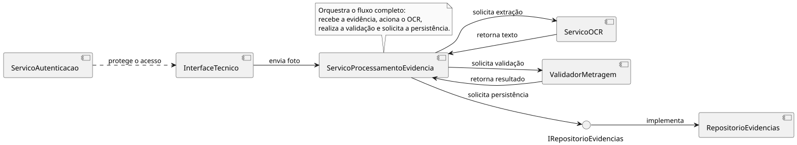

Esse diagrama representa a arquitetura de referência única, reaproveitada com diferentes recortes e níveis de abstração ao longo das 13 abordagens de teste apresentadas neste laboratório.

---

## Glossário de Módulos e Classes

### Camada de Interação / Atores

| Nome | Papel | Abordagens em que aparece |
|---|---|---|
| `Tecnico` | Técnico de campo que captura e envia a fotografia da evidência | 2.4, 4.1, 4.4 |
| `InterfaceTecnico` | Ponto de interação pelo qual o técnico envia a fotografia ao sistema | 2.1, 2.4, Visão Arquitetural |
| `SupervisorDeCampo` | Usuário de negócio responsável por aprovar a evidência para fins de medição/LPU | 3.1 |
| `EquipeQA` | Equipe interna responsável pelo Teste Alfa, em ambiente controlado | 3.2 |
| `TecnicoCampo` | Usuário real (grupo piloto) que utiliza o sistema em condições reais de trabalho | 3.3 |
| `UsuarioNaoAutorizado` | Ator que tenta acessar o sistema sem credenciais válidas | 4.2 |
| `GeradorDeCarga` | Ferramenta de teste que simula um alto volume de requisições simultâneas | 4.3 |

### Camada de Serviço / Lógica de Negócio

| Nome | Papel | Abordagens em que aparece |
|---|---|---|
| `ServicoProcessamentoEvidencia` | Orquestra o fluxo completo: aciona OCR, validação e persistência | 2.2, 4.1, Visão Arquitetural |
| `ServicoOCR` | Extrai o texto presente na fotografia da evidência | 2.1, 2.2, 2.3, Visão Arquitetural |
| `ValidadorMetragem` | Analisa o texto extraído e verifica se existe uma metragem válida do cabo | 1.1, 2.2, 2.3, 2.5, Visão Arquitetural |
| `ServicoAutenticacao` | Valida credenciais e permissões de acesso ao sistema | 4.2, Visão Arquitetural |
| `SistemaValidacaoEvidencia` | Representação simplificada (caixa-preta) do sistema completo, usada quando o foco do teste é o comportamento observável, não a implementação interna | 3.1, 3.2, 3.3, 4.2, 4.3, 4.4 |

### Camada de Dados

| Nome | Papel | Abordagens em que aparece |
|---|---|---|
| `ResultadoValidacao` | Objeto de retorno da validação, contendo status de aprovação, metragem identificada e mensagem | 1.1, 2.1, 2.2, 2.5 |
| `IRepositorioEvidencias` | Interface de contrato para persistência do resultado da validação | 2.2, Visão Arquitetural |
| `RepositorioEvidencias` | Componente responsável por persistir o resultado da validação (versão real) | 2.1, 4.1, Visão Arquitetural |
| `RepositorioEvidenciasStub` | Implementação simulada de `IRepositorioEvidencias`, usada enquanto o componente real não está disponível | 2.2 |

### Artefatos de Teste

| Nome | Papel | Abordagens em que aparece |
|---|---|---|
| `ValidadorMetragemDriver` | Artefato de teste que simula temporariamente o módulo de alto nível para acionar componentes de baixo nível | 2.3 |
| `ValidadorMetragemRegressaoSuite` | Suíte de testes que reexecuta casos existentes e novos após uma alteração em `ValidadorMetragem` | 2.5 |
| `CanalFeedback` | Mecanismo pelo qual usuários reais reportam problemas ou sugestões durante o Teste Beta | 3.3 |

---

## 1. Teste de Unidade (Unit Testing)

### 1.1 Verificação de lógica atômica em componente/classe isolada

#### Diagrama de Classes UML

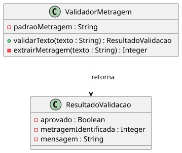

#### Explicação Textual

Nesta abordagem, o objetivo é verificar isoladamente a lógica interna da classe `ValidadorMetragem`, responsável por analisar um texto que simula a saída do OCR e determinar se ele contém uma metragem de cabo válida.

O teste concentra-se no método `validarTexto(texto: String)`, que recebe o texto e retorna um `ResultadoValidacao`. Internamente, a classe utiliza `extrairMetragem(texto: String)` para identificar o valor numérico da metragem. A separação entre extração e validação permite testar essas responsabilidades de forma mais granular.

O `ResultadoValidacao` representa o resultado do processamento, contendo informações como o status de aprovação, a metragem identificada e uma mensagem explicativa. Como se trata de um teste de unidade, a entrada é fornecida diretamente pelo teste, sem dependências externas como OCR, banco de dados ou APIs.

O principal objetivo é identificar falhas na lógica de reconhecimento e validação, como aprovar uma metragem inválida, reprovar uma metragem válida, extrair um valor incorreto ou produzir um resultado inconsistente. Dessa forma, os erros são detectados na classe isoladamente antes de sua integração com os demais componentes do sistema.

---

## 2. Teste de Integração (Integration Testing)

### 2.1 Integração Não Incremental (Big Bang)

#### Diagrama de Componentes UML

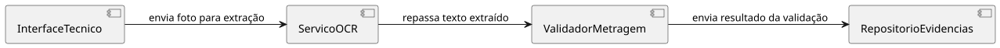

#### Explicação Textual

Nesta abordagem, o objetivo é testar a integração completa do fluxo de validação de evidências fotográficas, integrando de uma só vez os módulos `InterfaceTecnico`, `ServicoOCR`, `ValidadorMetragem` e `RepositorioEvidencias`, sem o uso de stubs ou drivers. Essa integração simultânea caracteriza a estratégia Big Bang.

O fluxo começa no `InterfaceTecnico`, por onde o técnico envia a fotografia. O `ServicoOCR` recebe a imagem e extrai o texto identificado. Em seguida, o texto é encaminhado ao `ValidadorMetragem`, responsável por verificar se existe uma metragem válida e gerar o resultado da validação. Por fim, esse resultado é enviado ao `RepositorioEvidencias`, responsável por armazenar o registro.

O principal objetivo do teste é identificar falhas de integração e comunicação entre os componentes, como formatos de dados incompatíveis, contratos incorretos ou informações que não sejam corretamente repassadas entre os módulos.

Uma característica dessa abordagem é que, caso ocorra uma falha, pode ser mais difícil identificar sua origem, pois todos os componentes são integrados e testados simultaneamente. Diferentemente das estratégias incrementais, não existem etapas intermediárias que permitam isolar progressivamente os problemas de integração.

### 2.2 Integração Incremental Top-Down (Descendente) com uso de Stubs

#### Diagrama de Classes UML

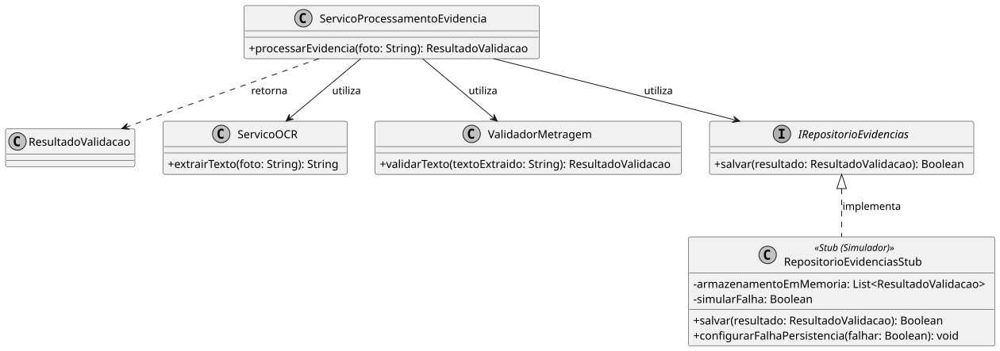

#### Explicação Textual

Nesta abordagem, o objetivo é testar o módulo de alto nível `ServicoProcessamentoEvidencia`, responsável por orquestrar o fluxo de validação de evidências fotográficas, realizando a integração de forma incremental e descendente (Top-Down). Diferentemente da abordagem 2.1 (Big Bang), os componentes são integrados progressivamente, partindo do módulo de alto nível em direção aos componentes de baixo nível.

No cenário representado, `ServicoProcessamentoEvidencia` está integrado com `ServicoOCR` e `ValidadorMetragem`, responsáveis respectivamente por extrair o texto da fotografia e validar a metragem identificada. O `RepositorioEvidencias` real ainda não está disponível, sendo substituído pela implementação `RepositorioEvidenciasStub` da interface `IRepositorioEvidencias`.

O `RepositorioEvidenciasStub` simula a persistência em memória e permite controlar o comportamento do teste por meio de `configurarFalhaPersistencia()`. Dessa forma, é possível testar tanto o fluxo de sucesso quanto o comportamento do sistema diante de uma falha de persistência, sem depender de um banco de dados real.

Essa etapa representa parte de uma integração Top-Down maior. Conforme os componentes de baixo nível ficam disponíveis e são validados, os respectivos Stubs podem ser substituídos pelas implementações reais até que toda a cadeia esteja integrada.

O principal objetivo é verificar se `ServicoProcessamentoEvidencia` coordena corretamente as chamadas entre os componentes e trata adequadamente seus retornos. O teste pode revelar problemas como chamadas fora de ordem, tratamento incorreto de falhas de persistência ou dependências indevidas em detalhes do repositório.

### 2.3 Integração Incremental Bottom-Up (Ascendente) com uso de Drivers

#### Diagrama de Classes UML

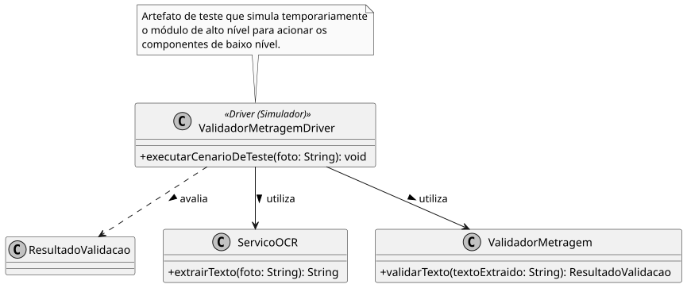

#### Explicação Textual

Nesta abordagem, o objetivo é testar a integração entre os componentes de baixo nível `ServicoOCR` e `ValidadorMetragem`, que já estão implementados e testados, antes que o módulo de alto nível `ServicoProcessamentoEvidencia` esteja disponível. Diferentemente da abordagem 2.2 (Top-Down), a integração ocorre de baixo para cima, partindo dos componentes inferiores em direção ao módulo controlador.

Como o orquestrador ainda não está disponível, utiliza-se o `ValidadorMetragemDriver`, um artefato de teste que assume temporariamente o papel do módulo de alto nível. Por meio do método `executarCenarioDeTeste(foto: String)`, o Driver aciona o `ServicoOCR`, que extrai o texto da fotografia, e posteriormente o `ValidadorMetragem`, que valida o texto extraído. Ao final, o Driver avalia o `ResultadoValidacao` retornado.

O `ServicoProcessamentoEvidencia` não aparece no diagrama propositalmente, pois ainda não está disponível nessa etapa. O Driver permite testar a integração entre os componentes reais sem depender da implementação do módulo superior.

A principal diferença em relação ao 2.2 é que, no Top-Down, utiliza-se um Stub para representar uma dependência inferior ainda não disponível. No Bottom-Up, utiliza-se um Driver para representar temporariamente o componente superior que ainda não foi implementado.

O principal objetivo do teste é verificar se o fluxo entre `ServicoOCR` e `ValidadorMetragem` funciona corretamente, identificando possíveis falhas de interface, como incompatibilidade no formato do texto extraído, tratamento incorreto de resultados vazios ou problemas na comunicação entre os componentes.

### 2.4 Teste de Fumaça (Smoke Testing)

#### Diagrama de Sequência UML

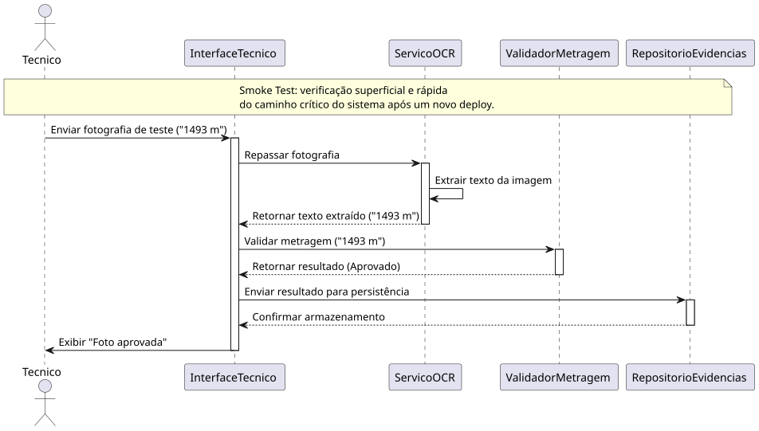

#### Explicação Textual

Nesta abordagem, o objetivo é verificar rapidamente, logo após um novo deploy, se o caminho crítico do fluxo de validação de evidências fotográficas está operacional, sem explorar múltiplos cenários, casos de borda ou situações de erro. Essa verificação superficial caracteriza o Teste de Fumaça (Smoke Test), cujo objetivo é determinar se o sistema está minimamente estável para prosseguir com testes mais aprofundados.

O cenário representa um `Tecnico` enviando, por meio da `InterfaceTecnico`, uma única fotografia de teste contendo a metragem válida `"1493 m"`. A interface encaminha a fotografia ao `ServicoOCR`, que extrai o texto e o retorna. Em seguida, o texto é enviado ao `ValidadorMetragem`, que retorna o resultado da validação. Por fim, o resultado é encaminhado ao `RepositorioEvidencias`, que confirma o armazenamento, permitindo que a interface exiba ao técnico a mensagem `"Foto aprovada"`.

O diagrama representa apenas o caminho principal (happy path), sem cenários de erro ou casos de borda. Essa escolha é proposital, pois o Smoke Test busca apenas confirmar que as principais etapas captura, extração, validação e persistência — estão funcionando após o deploy.

O principal objetivo é identificar rapidamente falhas graves no fluxo principal, como serviços indisponíveis, problemas de configuração ou quebras de comunicação entre módulos. Caso o teste falhe, o sistema pode ser considerado instável e os testes mais detalhados não devem prosseguir até que o problema seja corrigido.

### 2.5 Teste de Regressão

#### Diagrama de Classes UML

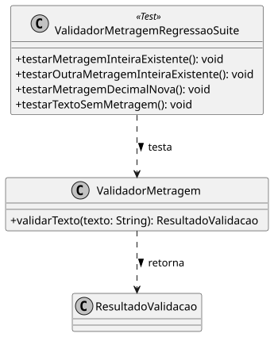

#### Explicação Textual

Nesta abordagem, o objetivo é garantir que uma alteração recente na classe `ValidadorMetragem` não tenha comprometido comportamentos que já funcionavam corretamente. Esse é o princípio central do Teste de Regressão: reexecutar testes existentes após uma alteração para verificar se as funcionalidades anteriores continuam operando como esperado.

A alteração realizada consiste em ampliar o método `validarTexto(texto: String): ResultadoValidacao` para reconhecer também metragens no formato decimal, como `"1.493 m"`, além dos formatos inteiros já suportados, como `"1493 m"` e `"850 m"`.

Após essa mudança, a `ValidadorMetragemRegressaoSuite <<Test>>` executa novamente os casos existentes e também o novo cenário. Os métodos `testarMetragemInteira()` e `testarOutraMetragemInteira()` representam casos que já eram suportados e devem continuar passando. `testarTextoSemMetragem()` verifica que textos sem uma metragem válida continuam sendo reprovados. Já `testarMetragemDecimal()` verifica a nova funcionalidade adicionada.

O relacionamento `ValidadorMetragemRegressaoSuite ..> ValidadorMetragem : testa` representa a execução desses cenários sobre a classe modificada, enquanto `ValidadorMetragem ..> ResultadoValidacao : retorna` representa o resultado produzido pela validação.

O principal objetivo do teste é identificar regressões, ou seja, comportamentos que funcionavam antes da alteração e passaram a falhar depois dela. Por exemplo, uma mudança na lógica de reconhecimento do formato decimal poderia fazer com que uma metragem inteira anteriormente válida deixasse de ser reconhecida. A suíte de regressão permite detectar esse tipo de efeito colateral antes que a alteração avance para as próximas etapas de teste.

---

## 3. Teste de Validação (Validation Testing)

### 3.1 Critérios de Aceitação (User Acceptance Testing)

#### Diagrama de Sequência UML

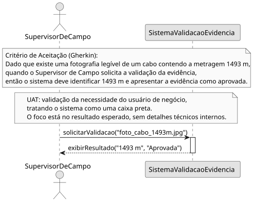

#### Explicação Textual

Nesta abordagem, o objetivo é verificar se o sistema atende às necessidades reais do negócio, sob a perspectiva do usuário que utiliza e se beneficia do resultado. Esse é o princípio central do Teste de Aceitação do Usuário (UAT): validar o sistema como uma caixa-preta, com base em critérios de aceitação previamente definidos, sem considerar como os componentes internos foram implementados.

O critério de aceitação utilizado neste cenário é: "Dado que existe uma fotografia legível de um cabo contendo a metragem 1493 m, quando o Supervisor de Campo solicita a validação da evidência, então o sistema deve identificar 1493 m e apresentar a evidência como aprovada". O formato Dado/Quando/Então permite representar o comportamento esperado de forma clara e testável.

O `SupervisorDeCampo` foi escolhido como ator principal por representar o usuário de negócio responsável por avaliar o resultado da evidência. Já o `SistemaValidacaoEvidencia` é representado como um único participante, sem detalhar componentes como `ServicoOCR`, `ValidadorMetragem` ou `RepositorioEvidencias`. Essa representação reforça que o UAT está concentrado no resultado entregue ao usuário, e não na implementação interna.

O fluxo representado é simples: o `SupervisorDeCampo` solicita a validação por meio de `solicitarValidacao()`, e o sistema retorna `exibirResultado()`, contendo a metragem identificada como `"1493 m"` e o status `"Aprovada"`. Dessa forma, o resultado obtido é comparado diretamente com o critério de aceitação definido.

O principal objetivo desse teste é identificar divergências entre o comportamento do sistema e as necessidades do negócio. Um sistema pode estar tecnicamente correto e ainda assim não atender ao UAT caso, por exemplo, a metragem não seja apresentada de forma clara, o resultado da aprovação não corresponda à regra de negócio ou o comportamento esperado pelo usuário não seja atendido.

### 3.2 Teste Alfa (Alpha Testing)

#### Diagrama de Sequência UML

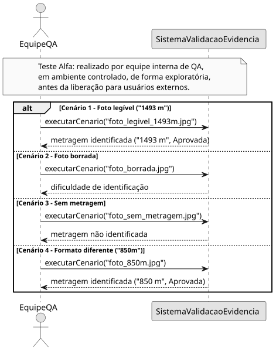

#### Explicação Textual

Nesta abordagem, o objetivo é testar o sistema de forma mais ampla e exploratória antes de sua liberação para os usuários finais. Diferentemente do UAT (3.1), que valida um critério de aceitação específico, o Teste Alfa é conduzido por uma equipe interna de QA, representada pelo ator `EquipeQA`, em um ambiente controlado que simula condições reais de uso.

O `SistemaValidacaoEvidencia` é tratado como uma caixa-preta, sem detalhar componentes internos como `ServicoOCR`, `ValidadorMetragem` ou `RepositorioEvidencias`. O foco está no comportamento observável do sistema diante de diferentes situações de uso.

O diagrama apresenta quatro cenários dentro do bloco `alt/else`: uma fotografia legível com metragem `"1493 m"`, uma fotografia borrada, uma fotografia sem metragem e uma fotografia contendo a metragem no formato `"850m"`. Esses cenários permitem verificar tanto o comportamento esperado em situações de sucesso quanto a forma como o sistema reage a entradas de menor qualidade ou variações de formato.

O principal objetivo desse teste é identificar defeitos de comportamento em diferentes condições de uso antes que o sistema seja disponibilizado externamente. Entre os problemas que podem ser encontrados estão dificuldades no tratamento de fotografias borradas, mensagens inadequadas quando nenhuma metragem é identificada e falhas no reconhecimento de formatos válidos de metragem.

### 3.3 Teste Beta (Beta Testing)

#### Diagrama de Sequência UML

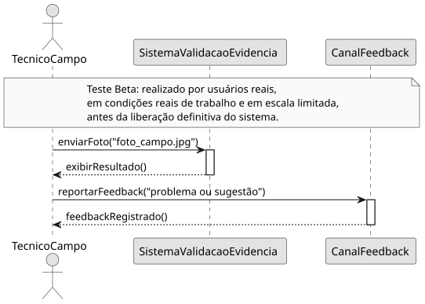

#### Explicação Textual

Nesta abordagem, o objetivo é avaliar o sistema em condições reais de uso, antes de sua liberação definitiva. Diferentemente do Teste Alfa (3.2), realizado internamente por uma equipe de QA em ambiente controlado, o Teste Beta envolve um grupo limitado de usuários reais, representados pelo ator `TecnicoCampo`, utilizando o sistema durante suas atividades normais de instalação de cabos.

O `TecnicoCampo` utiliza o `SistemaValidacaoEvidencia` para enviar fotografias produzidas durante o trabalho em campo. Nesse estágio, as condições de utilização não são previamente controladas pela equipe de testes, podendo existir situações como diferentes níveis de iluminação, ângulos de captura, qualidade das fotografias e problemas de conectividade. Essa exposição permite observar o comportamento do sistema diante de situações que podem não ter sido previstas durante os testes internos.

Após utilizar o sistema, o técnico pode identificar problemas, dificuldades ou oportunidades de melhoria e encaminhar essas informações por meio do `CanalFeedback`. O canal registra o retorno recebido, fechando o ciclo entre o uso real do sistema e a coleta de feedback dos usuários.

O principal objetivo desse teste é identificar problemas que surgem durante a utilização real do sistema, além de coletar percepções e sugestões dos usuários. Por exemplo, os técnicos podem relatar dificuldades para enviar fotografias em locais com conexão instável, problemas na identificação da metragem em determinadas condições de campo ou sugestões para tornar a utilização do sistema mais prática.

---

## 4. Teste de Sistema (System Testing)

### 4.1 Teste de Recuperação (Recovery Testing)

#### Diagrama de Sequência UML

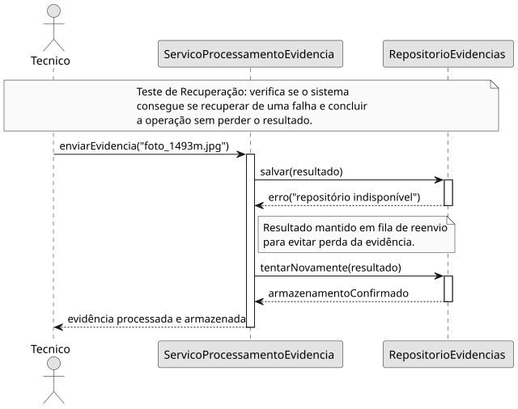

#### Explicação Textual

Nesta abordagem, o objetivo é verificar se o sistema consegue se recuperar de uma falha temporária sem perder os dados que estavam sendo processados. Esse é o princípio central do Teste de Recuperação (Recovery Testing): provocar uma situação de falha e avaliar se o sistema consegue retornar ao funcionamento normal de forma adequada.

No cenário representado, o `Tecnico` envia uma evidência por meio do `ServicoProcessamentoEvidencia`, que tenta armazenar o resultado no `RepositorioEvidencias`. Durante essa operação, o repositório fica temporariamente indisponível e retorna um erro. Em vez de descartar o resultado, o `ServicoProcessamentoEvidencia` mantém a informação em uma fila de reenvio, garantindo que a evidência não seja perdida.

Após a recuperação do `RepositorioEvidencias`, o serviço realiza uma nova tentativa por meio de `tentarNovamente(resultado)`. O repositório então confirma o armazenamento, e o `ServicoProcessamentoEvidencia` informa ao `Tecnico` que a evidência foi processada e armazenada.

O principal objetivo desse teste é identificar falhas relacionadas à recuperação após indisponibilidade de componentes, verificando principalmente se os dados são preservados durante a falha e se a operação consegue ser concluída posteriormente. Um problema seria, por exemplo, o sistema perder o resultado da validação após a queda do repositório ou não realizar corretamente a nova tentativa de persistência.

### 4.2 Teste de Segurança (Security Testing)

#### Diagrama de Sequência UML

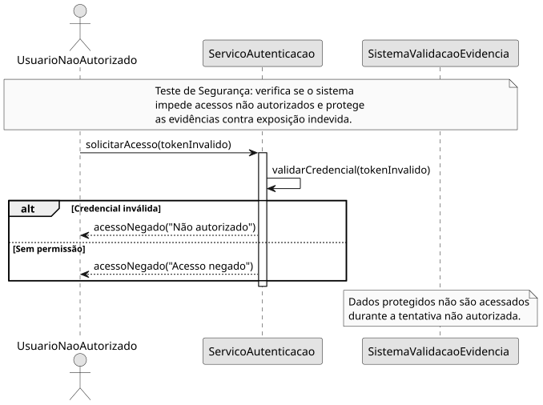

#### Explicação Textual

Nesta abordagem, o objetivo é verificar se o sistema protege corretamente as evidências fotográficas contra acessos não autorizados. Esse é o princípio central do Teste de Segurança (Security Testing): avaliar se usuários sem credenciais válidas ou sem as permissões necessárias são impedidos de acessar informações protegidas.

No cenário representado, o `UsuarioNaoAutorizado` tenta acessar as evidências por meio do `ServicoAutenticacao`, enviando um `tokenInvalido`. O serviço realiza a validação da credencial e identifica que o usuário não possui autorização para realizar a operação.

O diagrama apresenta dois possíveis motivos para a rejeição: credencial inválida ou ausência de permissão. Em ambos os casos, o `ServicoAutenticacao` retorna uma mensagem de `acessoNegado()` ao usuário. O `SistemaValidacaoEvidencia` não recebe a requisição e, consequentemente, nenhuma evidência ou informação protegida é disponibilizada.

O principal objetivo desse teste é identificar falhas de controle de acesso e autenticação que poderiam permitir que usuários não autorizados consultassem evidências fotográficas ou outras informações protegidas. Um problema grave seria, por exemplo, o sistema aceitar uma credencial inválida ou permitir que um usuário sem permissão alcançasse os dados das evidências.

### 4.3 Teste de Estresse (Stress Testing)

#### Diagrama de Sequência UML

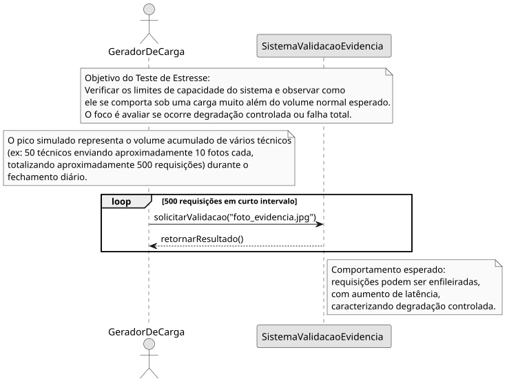

#### Explicação Textual

Nesta abordagem, o objetivo é avaliar os limites de capacidade do `SistemaValidacaoEvidencia` quando submetido a uma carga muito superior à utilização normal. Esse é o princípio do Teste de Estresse (Stress Testing): verificar como o sistema se comporta sob uma sobrecarga extrema.

O cenário representa um pico de requisições durante o fechamento diário das atividades. Para tornar a situação mais realista, o teste simula aproximadamente 500 requisições geradas por vários técnicos, em vez de considerar 500 técnicos conectados simultaneamente.

O `GeradorDeCarga` representa a ferramenta responsável por simular esse volume de solicitações. O bloco `loop` representa as 500 requisições enviadas ao `SistemaValidacaoEvidencia` em um curto intervalo de tempo. O comportamento esperado é uma degradação controlada, com possível enfileiramento e aumento da latência, sem indisponibilidade total.

Diferentemente do Teste de Desempenho (4.4), que verifica o tempo de resposta em condições normais de uso, o Teste de Estresse ultrapassa propositalmente a carga esperada para identificar os limites do sistema.

O principal objetivo é detectar problemas como aumento excessivo da latência, perda de requisições, falhas no processamento ou indisponibilidade, verificando se o sistema consegue continuar operando de forma controlada mesmo sob uma sobrecarga significativa.

### 4.4 Teste de Desempenho (Performance Testing)

#### Diagrama de Sequência UML

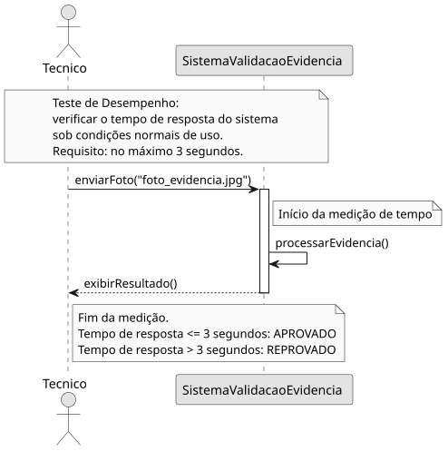

#### Explicação Textual

Nesta abordagem, o objetivo é verificar se o `SistemaValidacaoEvidencia` atende ao requisito de tempo de resposta definido para condições normais de uso. Esse é o princípio do Teste de Desempenho (Performance Testing): medir o comportamento do sistema em relação ao seu desempenho esperado.

O cenário representa um `Tecnico` enviando uma única fotografia ao sistema, sem sobrecarga. A partir do envio da fotografia, inicia-se a medição do tempo de resposta. O `SistemaValidacaoEvidencia` processa a evidência e retorna o resultado ao técnico.

O requisito estabelecido para o teste é que o resultado seja apresentado em no máximo 3 segundos. Assim, se o tempo medido for igual ou inferior a esse limite, o teste é considerado aprovado; caso ultrapasse 3 segundos, o requisito de desempenho não é atendido.

O principal objetivo desse teste é identificar problemas que possam tornar o sistema lento durante seu uso normal, como processamento demorado ou aumento inesperado do tempo de resposta. Diferentemente do Teste de Estresse (4.3), que utiliza uma carga acima do normal para avaliar os limites do sistema, o Teste de Desempenho verifica se o sistema apresenta um tempo de resposta adequado em condições esperadas de utilização.
